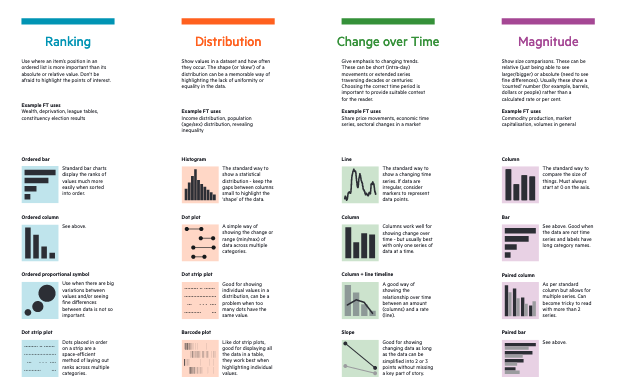
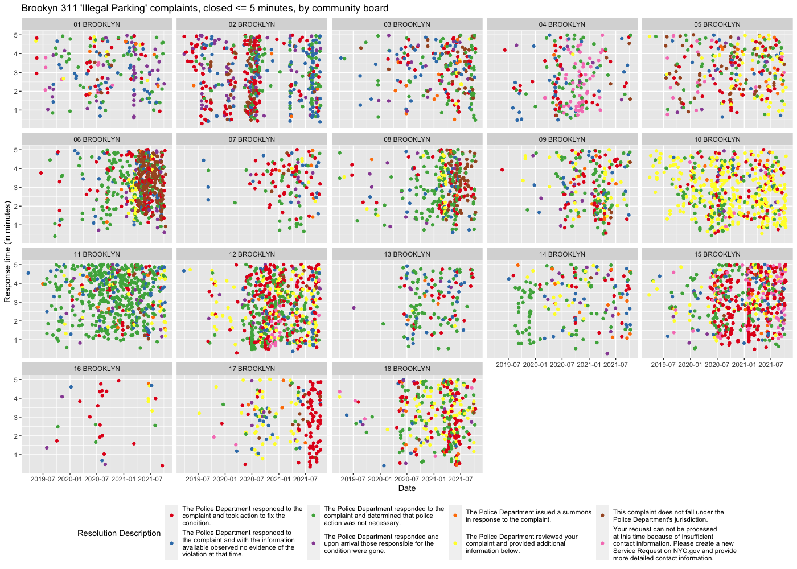

This page intentionally left blank. ⬇️, ➡️, or spacebar 🛰 to start slidedeck.
---
class: center, middle

# Welcome to Class 10!

---

# Agenda

- Housekeeping
- Blank Technology Canvas questions?
- News of the Week
- Readings
- Break!
- Privacy
- Data analysis
- Visualization
- BREAK!
- Data lab

---
class: middle, center

## Final project -- questions?

Links again to the final project assignment pages:

- Blank Technology Canvas Presentation
  - https://hadro.github.io/info654fa21/assignments/blank_technology_presentation
- Blank Technology Canvas Report
  - https://hadro.github.io/info654fa21/assignments/blank_technology_canvas_report

---

## News of the Week

Drop a link on the etherpad:
<https://etherpad.wikimedia.org/p/prattsi654fa21-10>

---
# Readings

- 2017-09-18. [Intro To Data Analysis For Everyone! Part 1](https://towardsdatascience.com/intro-to-data-analysis-for-everyone-part-1-ff252c3a38b5) (10 min + v20 min video)
- 2019-06-02. Lindsey Rogers Cook. [How We Helped Our Reporters Learn to Love Spreadsheets](https://open.nytimes.com/how-we-helped-our-reporters-learn-to-love-spreadsheets-adc43a93b919) (5 min)
- [Data + Design: A simple introduction to preparing and visualizing
information](https://orm-atlas2-prod.s3.amazonaws.com/pdf/13a07b19e01a397d8855c0463d52f454.pdf) Read Chapters 1-2 and 12-13 [PDF]
- 2018-10-17. Nathan Yau. [Ask the Question, Visualize the Answer](https://flowingdata.com/2018/10/17/ask-the-question-visualize-the-answer/) (6 min)
- 2019-02. Kashmir Hill. [Goodbye Big Five](https://gizmodo.com/c/goodbye-big-five) (Either read text or watch videos)
- 2019-11-05. Amelia Acker. [Data Craft: The Manipulation of Social Media Metadata](https://datasociety.net/output/data-craft/) (Download PDF -- 15 min)
- Current. [Library Freedom Project](https://libraryfreedomproject.org/) (timeless)
- 2018-04. Data Privacy Project. [A zine about privacy at the library](https://dataprivacyproject.org/wp-content/uploads/2018/04/zine_for_printer_printing_order.pdf) [PDF]

---
class: middle, center

# Break!

---

# Privacy

--

Let's start here:

## **What is privacy?**

--

What does it mean in the context of technology we've covered in this class?

---

# Privacy

--
Is privacy good?

--

If so, why?

--

Why does privacy matter?

Why is it important?

---
# Privacy

Are there cases where privacy comes into conflict with other things we value?

What are some examples?

What about technology-specific examples?

---
# Privacy

Is there a right to privacy?

--
At least in the US, it's not actually enshrined in the constitution or amendments.  

--
So how have we derived our current notions around privacy?

--

It ends up being implied -- but not explicit! -- in two major amendments:

- Fourth Amendment (against search and seizure)
- Fourteenth Amendment (equal protection under the law)

---

# Metafilter on privacy

https://www.metafilter.com/113517/Global-Village-People

> I have sometimes wondered whether the word "privacy" will sound to our grandchildren the way the word "honor" sounds to us.

> "There was a time when people thought this was a real thing with immense value, which, once lost, was lost forever, and so they would go to incredible lengths to preserve it. People were weird back then."

> <small>posted by escabeche at 15:08 on March 4, 2012</small>

---

# Privacy

## Takeaway

Personal privacy is a complex topic, and people have very different feelings about it!

In a consumer technology context, and especially in the information professions, the most important thing is to understand the **ramifications and implications** of the things you are working on -- 

--

especially when it comes to data collection and analysis.

---

# Data analysis

--

Quick review (think back to structured data week):

- CSV: Comma Separated Values

Very often delivered via API as well, most often via JSON

---

# Data analysis

## Types of data

- Categorical
  - Nominal (factor)
      - Binary/logical
  - Ordinal
- Numerical
  - Integers/decimals
  - Date/time
  - Interval

---
# Data analysis

## Types of data

Other ways of describing data categories:
Continous vs discrete

---

# Data analysis

## Three example files to work within
- **NYC 311 Data sample**
  - https://raw.githubusercontent.com/hadro/info654fa21/master/data/311_sample.csv
- **The Metropolitan Museum of Art open data release**
  + https://raw.githubusercontent.com/hadro/info654fa21/master/data/Met_sample.csv
- **Squirrel Census**
  - https://raw.githubusercontent.com/hadro/info654fa21/master/data/Squirrel_sample.csv

Open one of these data sample links in your own browser

--

After you've looked at it for a minute in a web browser, save one or both of the files to your computer

---

# Exploratory data analysis

Try opening it up on your computer (should open in Excel, or Numbers, or LibreOffice; if no program will open it don't worry, just follow my screen)

- Filter rows
- Start sorting

--
- Check length of data (how much are we dealing with?)
- Check how many columns of variables there are
- Are there column headings? If so, do they make obvious sense?
- Get a sense for what kind of responses are in each columns
  - is the data categorical or freeform with a column?
  - Does it fall within a certain range if it's numerical?
  - Are there a lot of blank fields in a column?

---

# Moving from data to conclusion

What are the kinds of questions we can answer with the following:
- Open Data from the NYC 311 Data collection?
- Open Data from the Met Museum?
- The Squirrel census data?

--

What are the kinds of stories we can tell with those data sets?

---

# Interlude

## Bias in data!

- Who is collecting the data?
- Who or what is represented in the data?
- What safeguards are in place?
- How could this data be used against someone?
- How could a person or a group of people be misrepresented by this data?

--
   
  
What kinds of biases are potentially baked into those previous data sets?
- 311 data? 
- Met Museum open access data? 
- Squirrel census data? 

---

# Visualization

Great vocabulary of chart types, and ways to use data viz to convey meaning:

https://github.com/ft-interactive/chart-doctor/raw/master/visual-vocabulary/Visual-vocabulary.pdf

---

# Visualization

Some of the most powerful:
- Distribution (particularly histogram)
- Change Over Time (generally known as time-series plots)
- Magnitude

---

# Visualization

## Grammar of graphics and plots

The world of data viz and analysis very much has it's own grammar and vocabulary; here are some of the initial basic terms (and synonyms) you are likely to encounter.

N.B. Different systems do this differently! For example, GGPlot in the R programming language uses a different vocabulary than Plotly in Python, but accomplishes the same thing.

- Geometry or plot type
  - Histogram
  - Scatter
  - Bar
  - Line
- Traces, plots, data element, variable
  - Dimensions
- Axes
- Filtering

---

# Examples from Life Experience

---
# Examples from Life Experience

Here are just a few examples of data analysis and data viz I've done in real-life situations:
- [Analysis of NYPD responses to 311 illegal Parking complaints](https://twitter.com/Hadro/status/1448846765499822094)
- [Analysis of the Greene Hill Food Co-op usage patterns](https://hadro.github.io/ghfc/ghfc_psfc_report)
  - Written using R programming language and RMarkdown, with a viz tool called [GGPlot](https://ggplot2.tidyverse.org/)
- [HathiTrust Usage Analysis](https://hadro.github.io/hathi_analysis/analysis.html)
  - Written using Python and Jupyter Notebooks

---

# Visualization

## Exploratory data viz

Let's try using the data we examined above, in a tool call Plot.ly

https://plot.ly/create/

- 311 Data: 
- <https://raw.githubusercontent.com/hadro/info654fa21/master/data/311_sample.csv>

- At top left, click "Import"
- select "By URL" Tab, and paste in the 311 CSV data URL above
- Add a "trace" in the left pane, and try out different plot types with different variable combinations (i.e., try selecting different variables in the 'X' and 'Y' fields)
  - Tip: Scatter, Bar, and Histogram will be the easiest until you have a deeper understanding of the contours of the data

---

# Visualization

## Exploratory data viz

Asking again:
- What are the kinds of stories we can tell with this 311 data set?

--

- What kinds of bias and error seem baked into this data set?

---
# Exploring and Visualizing other data sets

Good example sets to play with:

- 311 Data (full data going back to 2010, warning this is huge!): https://data.cityofnewyork.us/Social-Services/311-Service-Requests-from-2010-to-Present/erm2-nwe9
- 2018 Central Park Squirrel Census (!): https://data.cityofnewyork.us/Environment/2018-Central-Park-Squirrel-Census-Squirrel-Data/vfnx-vebw

- Popular data sets: https://data.cityofnewyork.us/browse?sortBy=most_accessed&utf8=%E2%9C%93

- Great projects!: https://opendata.cityofnewyork.us/projects/

---

# Exploring NYC Open Data Portal

Has a built-in exploratory data viz tool!

--

It's not perfect, but it can help get us started.

---

# Exploring NYC Open Data Portal

- Explore the ["Popular Data Sets"](https://data.cityofnewyork.us/browse?limitTo=datasets&q=&sortBy=most_accessed&utf8=%E2%9C%93)
- Pick one and click into it
- At the top, click "Visualize..." and then "Create Visualization" (not "Open in Plotly", because these will mostly be too big to export to Plotly well)
- From there, begin by picking "Dimensions" from the drop-down on the left
- After trying a few of those, try picking one of the different plot in the icons above the viz window (try to pick one with a green "recommended" view)
