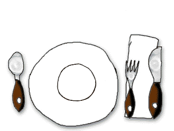
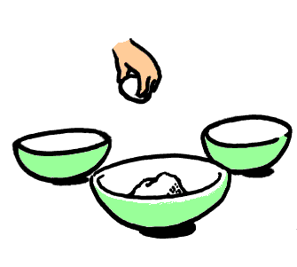

This page intentionally left blank. ⬇️, ➡️, or spacebar 🛰 to start slidedeck.
---
class: center, middle

# Welcome to Class 14!

---

# Agenda

- Questions?
- News of the Week
- Readings
- Break!
- Databases


---
## Assignment questions?

### Other questions?

---

## News of the Week

Drop a link on the etherpad:
<https://etherpad.wikimedia.org/p/prattsi654fa21-14>

---

## Readings

<p>Readings:</p>

<ul>
  <li>2008-10-23. Ryan Deschamps. <a href="http://otherlibrarian.wordpress.com/2008/10/23/what-is-a-database-really-data-storage-for-librarians/">What is a Database, really? Data Storage for Librarians</a> (12 min)</li>
  <li>Current. Wikiversity. <a href="https://en.wikiversity.org/wiki/Relational_Databases/Introduction">Introduction to Relational Databases</a> (10 min)</li>
  <li>c.2009. Randy Jay Yarger, George Reese, and Tim King. <a href="http://docstore.mik.ua/orelly/linux/sql/ch01_01.htm">Chapter 1. Introduction to Relational Databases</a> (10 min)</li>
  <li>2013-11-07. Noah Veltman. <a href="https://schoolofdata.org/2013/11/07/sql-databases-vs-excel/">SQL: The Prequel (Excel vs. Databases)</a> (13 min)</li>
  <li>2015-09-12. Ruth Kitchin Tillman. <a href="http://ruthtillman.com/an-introduction-to-sql-for-librarians/">An Introduction to SQL for Librarians</a> (12 min)</li>
  <li>
    <p>2015-06-27. qntm. <a href="https://qntm.org/support">Obergefell v. Hodges: the database engineering perspective</a> (8 min)</p>
  </li>
</ul>
---
class: middle, center

# Break!

---
class: center, middle

# Databases 🥞

---


[The best database webcomic ever drawn](http://nedroid.com/2012/05/honk-the-databus/)

---
# Databases

A database is an organized collection of data that can easily be accessed and modified. 

By this broad definition, a list is a database. An Excel spreadsheet is a database. Everything is a database!

.right[]

---
# Databases

Before we get too deep into databases, a slight historical view... 


--

... but why do they look like that?

---

# Databases


---

# Databases

From our API class:
- Static data
- Flowing data
- Meaningful data

From the readings:
- Raw Text
- Structured Text (CSV)
- Tree-based structure (XML, JSON)
- The Relational model

---

# Databases

What are examples of databases with which you interact in daily life?

--

What are some of the largest databases out there?

--

What about some of the smallest?

---
# DBMS 

*Database Management System* 

But usually, when using the word "database," someone is referring to an entire database system. 

Examples of DBMS are Microsoft Access, FileMaker, or Oracle, MySQL, PostgreSQL and Microsoft SQL Server.

--

(Aspects of this are similar in some ways to the content management system properties we discussed last class)

.right[]

---
# Relational Databases

All of the previous examples were types of relational database frameworks. This relational model has been extremely popular since it was invented in the 1970s and is probably what people mean or are using when they talk about a database.   

A relational database is a collection of schemas, tables, queries, reports, views, and other elements.

.right[]


---
# The relational model

We have a bunch of books.
What basic info do we have about each one?

--

Let's say: 

- Author
- Title
- ISBN
- Publisher
- Date
- Edition

--

How do we break this apart so that we're not duplicating a ton of data?


---

# The relational model

Break it into (at least) two tables: 

**AUTHOR**
- *AuthorID*
- FirstName 
- LastName

**BOOK**
- *ISBN* 
- Title 
- Edition
- Publisher
- (FK: AuthorID)

---

# The relational model

Then, we can link elements of the two tables together to get the view we are likely most interested in:

- *AuthorID*
- FirstName
- LastName
- Title
- *ISBN*

---

# The relational model

Then, we can link elements of the two tables together to get the view we are likely most interested in:

- *AuthorID* (from `author` table)
- FirstName (from `author` table)
- LastName (from `author` table)
- Title (from `book` table)
- *ISBN* (from `book` table)

---

# Keys

- Primary key
- Foreign key

Every foreign-key value must appear as another table’s primary-key value

---

# Keys: Types of relationships


- One-to-one

- One-to-many

- Many-to-many

--

What are some examples of each of these?

---

# Keys: Types of relationships


- One-to-one (Social security #s, passport numbers, drivers license, License plates, etc.)
- One-to-many (Artist/paintings fits well into this model)
- Many-to-many (authors and articles – both can have many to many, ditto artists/compositions)

---

# Keys: Types of relationships

What does this actually look like in the context of a relational database?

--

Let's take a look at a Content Management System with which we're all familiar, and which makes elegant use of a database schema: WordPress.


Diagram: WordPress Database Schema
https://codex.wordpress.org/images/2/25/WP4.4.2-ERD.png


---
# How do databases work technically? 

[This article](http://coding-geek.com/how-databases-work/) does a great job at an in-depth computer science explanation of how databases work. Here is an overview of some of the significant components of a database:  

- Process manager
- Network manager
- File system manager
- Memory manager
- Security manager
- Client manager
- Backup manager
- Recovery manager
- Monitor manager
- Administration manager
- Query manager
- Data manager

---
# How do databases work? 

That's a lot of management! And many of the components do multiple tasks. Databases are doing a lot of work so that you don't have to.

.right[]
---
# (Very) basic pattern of interaction 

- You deliver a command to the database, probably written or parsed down into SQL (more on that later)
- The client manager determines if you are allowed to do that 
- The query manager checks your statement and optimizes it (determines the fastest way to get the answer)
- The hunt begins! (A lot of complex things happen here, computers doing computer stuff)
- The answer is returned to you, the user

---
# CRUD 

The four basic functions of persistent storage.  

**C** reate  
**R** ead  
**U** pdate  
**D** elete  

---
# ACID 

*Atomicity, Consistency, Isolation, Durability*

**A** tomicity: each transaction be complete fully or not at all; no partial transactions.    
**C** onsistency: any transaction will bring the database from one valid state to another.  
**I** solation: if multiple transactions occur, they must have the same result regardless of order.  
**D** urability: once a transaction has been committed, it will remain so, even if there's a crash or error.

---

# Interlude: Little Bobby Tables


https://xkcd.com/327/


---
# SQL 

*Structured Query Language*

A way to talk to databases using simple but powerful, declarative statements. 

It can be very finicky and frustrating, but appreciate all the work a database is doing for you!

Here are some major elements used in composing statements: 

- SELECT
- FROM
- WHERE
- ORDER BY

---
# SQL 
Commands look like this:  

`SELECT * FROM Cats`: returns everything in the Cat table.  

`SELECT Name FROM Cats WHERE Status = 'Kitten'`: returns the names of all cats with a kitten status.  

Maybe you forgot to make a kitten status when you designed your database, but you do have all the cat birthdays. You can do something like this:   

`SELECT Name FROM Cats WHERE BirthDate >= 2021-01-01` to find all cats born in the year 2021.  

---
# SQL 

How do we create data using SQL?

(N.B.: this won't work in sandboxes that are read-only, but gives you an idea of how this works.)

First we create the table schema, which describes the columns and what types of data are allowed in those columns.

```sql
CREATE TABLE employees (
    id            INTEGER      PRIMARY KEY,
    first_name    VARCHAR(50)  NULL,
    last_name     VARCHAR(75)  NOT NULL,
    dateofbirth   DATE         NULL
);
```


---
# SQL

Then, we use `INSERT INTO` to actually add values to the database table, in a way that conforms to the schema we just created:

```sql
CREATE TABLE employees (
    id            INTEGER      PRIMARY KEY,
    first_name    VARCHAR(50)  NULL,
    last_name     VARCHAR(75)  NOT NULL,
    dateofbirth   DATE         NULL
);

INSERT INTO employees VALUES
    (1, "Josh", "Hadro", "1900-01-01 00:00:00"),
    (2, "Andrew", "Hadro", "1902-01-01 00:00:00");
```

---

# SQL

Questions so far? 

---

# SQL 

Now, let's try out some live SQL queries using a tool called Datasette.

https://fivethirtyeight.datasettes.com/fivethirtyeight?sql=SELECT+year%2C+title%2C+binary+FROM+%5Bbechdel%2Fmovies%5D

[Which comes from a fascinating article titled [The Dollar-And-Cents Case Against Hollywood’s Exclusion of Women](https://fivethirtyeight.com/features/the-dollar-and-cents-case-against-hollywoods-exclusion-of-women/)]

---

Incidentally, that data was used to create this data viz, among others: 


---

# SQL

Just based on a basic look at the data in that table, what kinds of questions can we formulate? 

--

What are the interesting questions that might lead to some data narratives and storytelling?

What kinds of queries do we need in order to help us access that data?


---

# SQL

Let's start by working with that basic query.

- Try replacing the word `binary` in the saved query with `binary as "Bechdel test results"`, so the whole query reads: 
```sql 
SELECT year, title, binary as "Bechdel test results" FROM [bechdel/movies]
```
That's how it's possible rename a column to be more clear in a table view. 

--

- Now let's get a sense of *all* the data in this table. Replace the `select` criteria, and replace them with a `*` -- so the query reads as follows: 
```sql 
SELECT * FROM [bechdel/movies]
```
Take a look at all the column headers now shown. See if you can interpret what each of those is supposed to mean. 

---

# SQL

- Okay, that's a lot of data. Let's see how much! We can use a built-in calculation tool available in SQL:
```sql 
SELECT count(*) FROM [bechdel/movies]
```
That counts all the rows returned by our query instead of showing the raw data.

--

- Now that we know there are nearly 1800 entries, let's limit it a bit. Since it's a database table of movies that passed or failed the Bechdel Test, let's see just those that passed. To do this, we'll use the `WHERE` element.
```sql 
SELECT * FROM [bechdel/movies] WHERE binary = "PASS"
```
The `WHERE` element now sets a condition in the statement. Careful about capitalization here, since lowercase and uppercase will result in different queries. 

--

- Now, if we wanted to get just a count of how many passed, how would we do that? Try it on your own. 

---

# SQL

- But this is still too much data to scan easily. Let's add another condition, this time to look at data for just one year. In this case, we'll attach another SQL conditional using the boolean operator `AND` (other options include `OR`, `AND NOT`, `OR NOT`, etc.)
```sql 
SELECT * FROM [bechdel/movies] WHERE binary = "PASS" AND year = 2005
```
Try this out for a few different years!

--

- Finally, let's try reordering this data so it's not just default alphabetical by title. To do this, we use `ORDER BY` which allows us to specify a column or other data element, and we can then also choose whether it should be `ASC` (ascending) or `DESC` (descending).
--

```sql 
SELECT * FROM [bechdel/movies] WHERE binary = "PASS" 
AND year = 2005 ORDER BY intgross_2013$ DESC
```
Try changing the column name by which this query orders the data to try a few other of the data factors in this table. Once you've done that, also try running variations of this ordered query for different years.

---
# SQL

- As further excercises, how would you go about: 
    - trying to query two different years at the same time? 
    - What about selecting all years between 2008 and 2013?


---
# SQL

- As further excercises, how would you go about: 
    - trying to query two different years at the same time? 
```sql 
SELECT * FROM [bechdel/movies] WHERE binary = "PASS" 
AND (year = 2005 OR year = 2006) ORDER BY budget DESC
```
    - What about selecting all years between 2008 and 2013?
```sql 
SELECT * FROM [bechdel/movies] WHERE binary = "PASS" 
AND (year >= 2008 AND year <= 2013) ORDER BY budget DESC
```
--
- As a final advanced option, we can use the `LIKE` operator to find any title that has the number "2" in it, in this case to look for sequels (get it?!)
```sql 
SELECT * FROM [bechdel/movies] WHERE binary = "PASS" 
AND (title LIKE "% 2%") ORDER BY year ASC
```
In this case, the `%` sign means that the `" 2"` can appear anywhere in the title string. 

---
# SQL

Pretty powerful stuff, no?!

If you made it this far, try creating some of your own SQL queries using another one of the 538 datasettes available here:
- https://fivethirtyeight.datasettes.com/fivethirtyeight

Or try any of the example datasettes here: 
- https://datasette.io/examples
