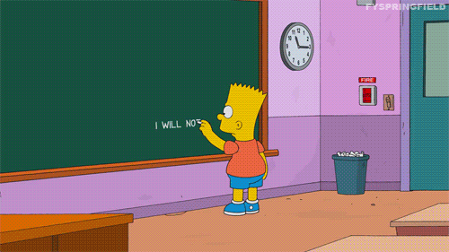

This page intentionally left blank. ⬇️, ➡️, or spacebar 🛰 to start slidedeck.
---
class: center, middle

# Welcome to Class 15!
--

`<sniffle>`The last class! `</sniffle>`

---

# Agenda

- Housekeeping
- (Final!) News of the Week
- Readings – what connections did you make?!
- What inspired you?
- Future of Libraries, Museums, Design, and Consumer Tech!
- Thoughts for next semester?
- Last speech
- Class evaluations

---
## Housekeeping

### Final assignments in my inbox!

### Other questions?

---

## News of the Week

Drop a link on the etherpad:
<https://etherpad.wikimedia.org/p/prattsi654fa21-15>

---

# Readings

<ul>
  <li>2014-09. Keir Winesmith and Flora Grant. <a href="https://www.sfmoma.org/read/how-do-institutional-philosophies-manifest-online-collections/">How Do Institutional Philosophies Manifest in Online Collections?</a> (16 min)</li>
  <li>2013-08. <a href="https://sr.ithaka.org/wp-content/uploads/2013/08/SR_BriefingPaper_Anderson.pdf">Can’t Buy Us Love: The Declining Importance of Library Books and the Rising Importance of Special Collections</a> [PDF]</li>
  <li>2017-05-10. Beatrice Martini. <a href="https://beatricemartini.it/blog/decolonizing-technology-reading-list/">Decolonizing technology: A reading list</a> (8 min)</li>
  <li>2014-05-13. Jason Scott. <a href="http://ascii.textfiles.com/archives/4285">The Robot Army of Good Enough</a> (8 min)</li>
  <li>2017-08-10. Jennifer Howard. <a href="https://www.edsurge.com/news/2017-08-10-what-happened-to-google-s-effort-to-scan-millions-of-university-library-books">What Happened to Google’s Effort to Scan Millions of University Library Books?</a> (9 min)</li>
  <li>2018-10-16. Melanie Ehrenkranz. <a href="https://gizmodo.com/how-archivists-could-stop-deepfakes-from-rewriting-hist-1829666009/amp">How Archivists Could Stop Deepfakes From Rewriting History</a> (8 min)</li>
  <li>c.2019 or 2020. Mozilla. <a href="https://foundation.mozilla.org/en/internet-health-report/">Internet Health Report</a></li>
  <li>2018-06-15. MoreThanCode. <a href="https://morethancode.cc/2018/06/15/morethancode-executive-summary.html">#MoreThanCode: Practitioners reimagine the landscape of technology for justice and equity (executive summary)</a></li>
</ul>

---
class: middle, center

# Break!

---
class: middle, center

# The Future!

---
class: middle, center

---

## Let's compare notes

-	What are the most exciting/compelling technology things you’ve encountered this semester?

--

- What are the most worrisome technology things you have seen this semester?

---

## Looking toward the professions

- What do you think are the most important or innovative profession-related technologies you've seen this semester?

--

- What technology are you most excited about to dig into a bit deeper?

--

- **Maybe most importantly:** How do you feel about your role in understanding and working with these technologies?

- What will you do differently as a result of what you've learned this semester?

---

# Thoughts for next semester?

- What suggestions would you make to improve the experience for your peers, either next semester or a year from now?

---
class: center, middle

# Last speech

---
class: center, middle

# Class evaluations

